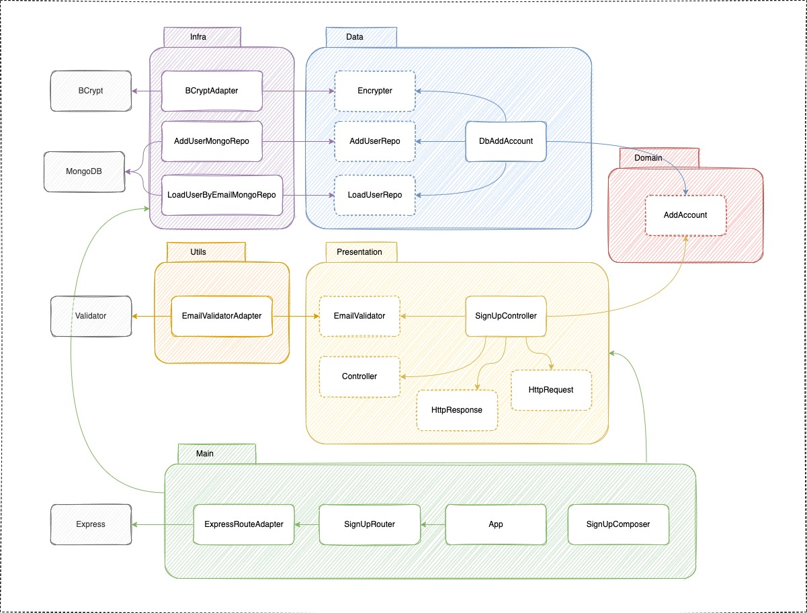

# Clean Node API (Typescript)

It's a simple project to learn TDD, DDD, Conventional Commits, Standard JS, Husky with pre-commit and pre-push hooks validating Standard JS via eslint and test coverage.

Architecture:

Requirements:
 - Node
 - Docker
 - Docker-compose

First steps:
 - Installing dependencies
 > npm install

 - Start mongodb
 > docker-compose up -d

# Commands

Run server:
 > npm run start 

Run tests
 > npm run test

Run tests verbose
 > npm run test:verbose

Run all unit tests (**.spec.ts)
 > npm run test:unit

Run all integration tests (**.test.ts)
 > npm run test:integration

Run all tests from staged files
 > npm run test:staged

Run tests and generate coverage
 > npm run test:ci
 ----------------------

